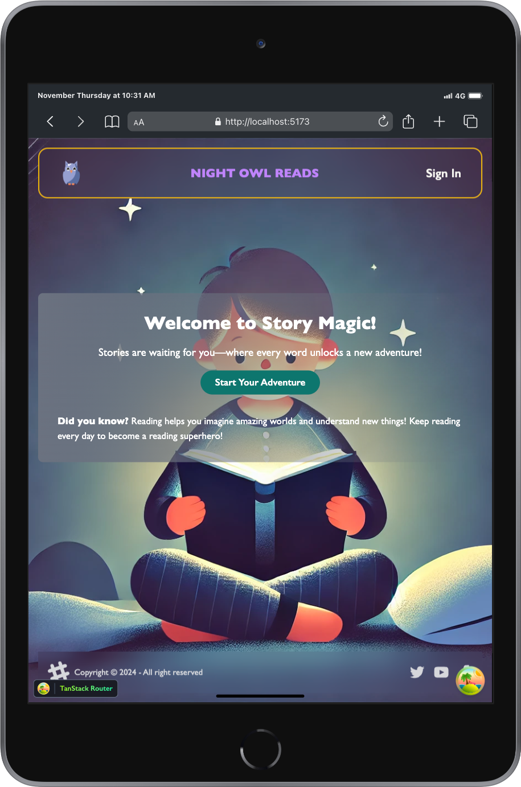
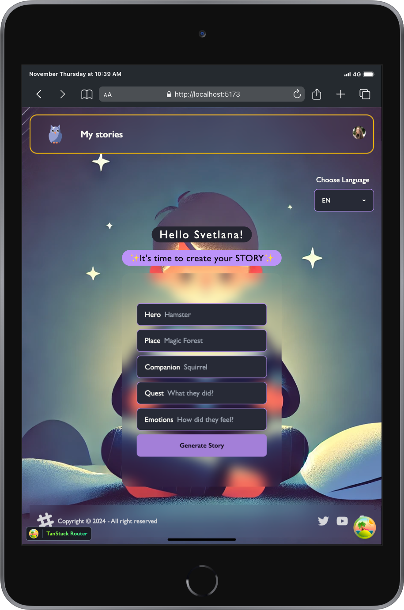
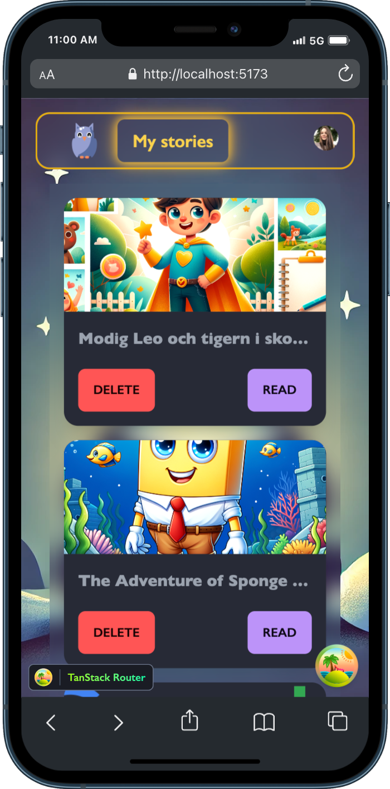

# 🌟 Night Owl Reads

Welcome to **Night Owl Reads**, an interactive and personalized story generation app designed to spark imagination and encourage early readers to fall in love with storytelling. Whether you're a parent looking for a quick bedtime story, a teacher searching for creative classroom material, or a child exploring the world of reading, **Night Owl Reads** delivers a magical experience.

---

## 🚀 Purpose of the Project

**Night Owl Reads** was created to:

- **Encourage independent reading**: Designed for beginners (ages 6+), the app makes stories accessible and engaging, especially for young readers just starting their reading journey.
- **Personalize storytelling**: Generate unique tales based on keywords provided by the user (hero, setting, activity, etc.).
- **Promote language learning**: With multi-language support, the app helps users explore storytelling in their preferred language.
- **Save time for parents and teachers**: Quickly generate age-appropriate, AI-powered stories complete with vivid illustrations.

---

## 🧙‍♂️ How It Works

1. **Input your keywords**: Provide words for the hero, place, quest, companion, and emotion.
2. **Generate magic**: AI creates a short, imaginative tale and a matching illustration based on your input.
3. **Engage interactively**: Read the story, listen to words pronounced aloud, or explore the beautiful illustrations.

---

## 🛠️ Tech Stack

### **Frontend**

- **Framework**: React with TypeScript
- **Styling**: Tailwind CSS for responsive and modern UI
- **Routing**: TanStack Router for seamless navigation
- **State Management**: React Query for data fetching and caching
- **Speech Features**: Browser `speechSynthesis` API to enable text-to-speech functionality

### **Backend**

- **Framework**: Spring Boot (Java) for RESTful API and business logic
- **Database**: NeonDB for storing stories, images, and user data
- **Image Storage**: Supabase Storage for storing and retrieving images
- **AI Integration**: OpenAI's GPT-4 for generating stories and DALL·E for creating illustrations

### **APIs**

- **OpenAI GPT-4**: To generate natural and engaging stories based on user inputs.
- **OpenAI DALL·E**: To create vivid, storybook-style illustrations for each tale.

---

## 🌍 Features

- **AI-Generated Stories**: Unique, imaginative stories tailored to user-provided keywords.
- **AI-Generated Illustrations**: Beautiful, vibrant illustrations that bring the stories to life.
- **Multi-Language Support**: Generate stories in multiple languages for global accessibility.
- **Interactive Storytelling**: Hover over words to hear them pronounced aloud, supporting early reading skills.
- **Responsive Design**: Works seamlessly on both desktop and mobile devices.
- **Editable Titles**: Users can rename their stories and personalize them further.

---

## 🎯 Why Night Owl Reads?

### The Problem:

Finding engaging, personalized, and age-appropriate stories for kids can be time-consuming. Many existing tools lack the creativity and interactivity young readers need.

### The Solution:

**Night Owl Reads** simplifies storytelling, providing parents, teachers, and children with instant, high-quality, and imaginative stories and illustrations—all with just a few clicks.

---

## 📸 Screenshots

[Watch the video on YouTube](https://youtube.com/shorts/Jx3S_R18oaM?feature=share)

[Watch the video on YouTube](https://youtube.com/shorts/j54pMv4kUwM?feature=share)

[Watch the video on YouTube](https://youtube.com/shorts/Nl1XHsLh1DQ?feature=share)